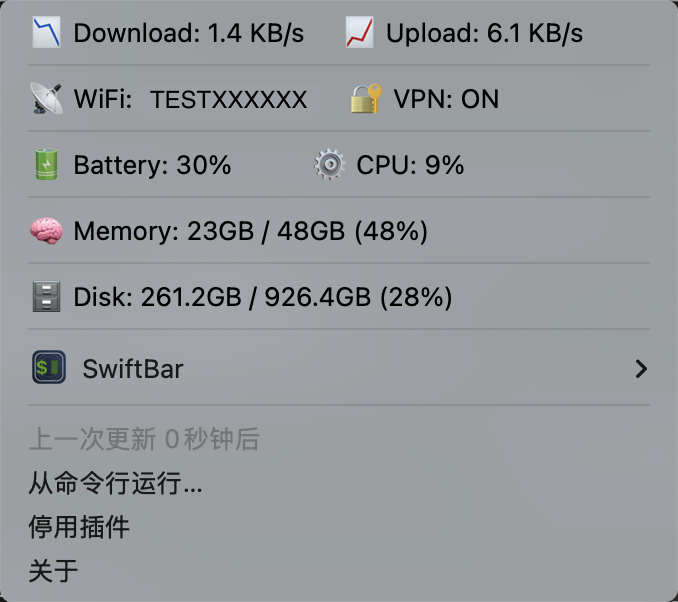

# systatus-mac

A SwiftBar plugin that shows live system status in the menu bar and a detailed drop‑down.

[English](README.md) | [中文](README.zh.md)



## Features

- Menu bar icon that shows battery percentage when below 30%.
- Download/Upload network speed (cached sampling, no sleep).
- Wi‑Fi name (from preferred networks on `en0`).
- VPN status (ON/OFF via `scutil --nc list`).
- Battery + CPU usage on one line.
- Memory and Disk usage.
- Two‑column layout with emoji labels and SwiftBar separators.

## Requirements

- macOS
- SwiftBar
- zsh

## Install

1. Put `keystats.1s.sh` into your SwiftBar plugins folder.
2. Make sure it is executable:

```sh
chmod +x keystats.1s.sh
```

3. In SwiftBar, refresh the plugin.

## Notes

- The Wi‑Fi name is read from the first entry of preferred networks on `en0`.
- VPN status is detected by any connected network service.
- For alignment, a monospaced font is recommended (e.g. SF Mono).

## Customize

- `RIGHT_COL` controls the alignment of the right column.
- `SYSINFO_INTERVAL` controls refresh of CPU/Memory/Disk cache.

## License

MIT
